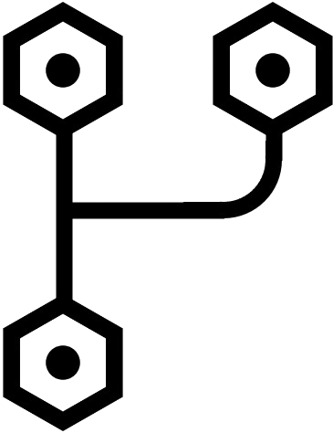

<h1 align="center" id="title">Push variables</h1>

This Figma plugin allows designers and developers to export design variables from Figma documents directly into code. Currently the plugin supports exporting variables to CSS and JSON formats. Future updates will include support for XML and Kotlin providing a versatile tool for integrating design and development workflows.

  
<h2>🧐 Features</h2>

Here're some of the project's best features:

*   Export Design Variables
*   Multiple Formats
*   Integration with GitHub

  
  
<h2>💻 Built with</h2>

Technologies used in the project:

*   Typescript
*   node.js
*   React
*   Material-UI

<h2>🛡️ License:</h2>

This project is licensed under the MIT License
